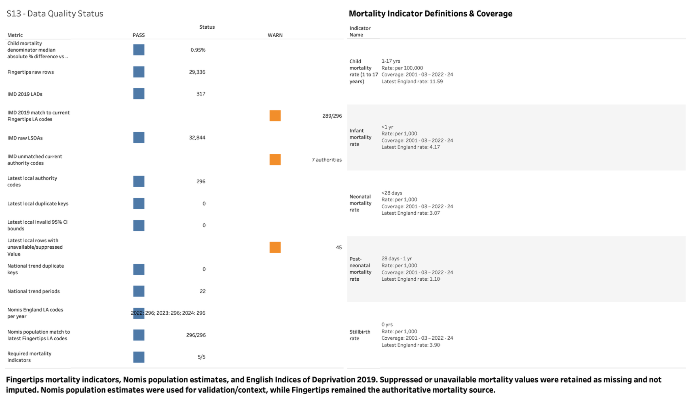
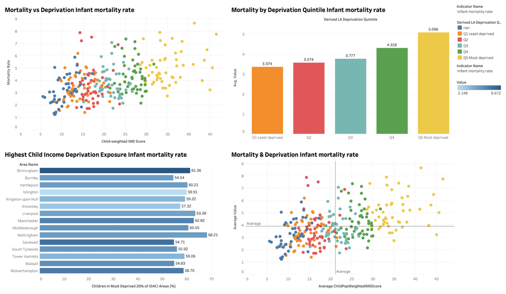
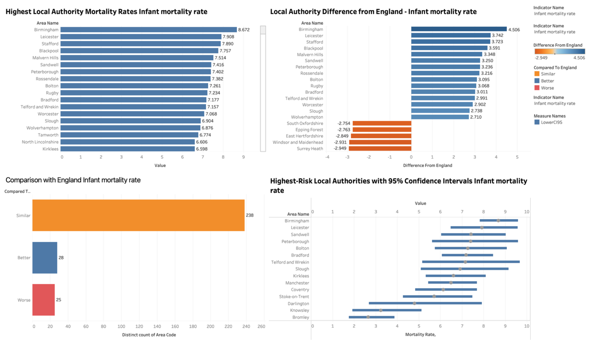
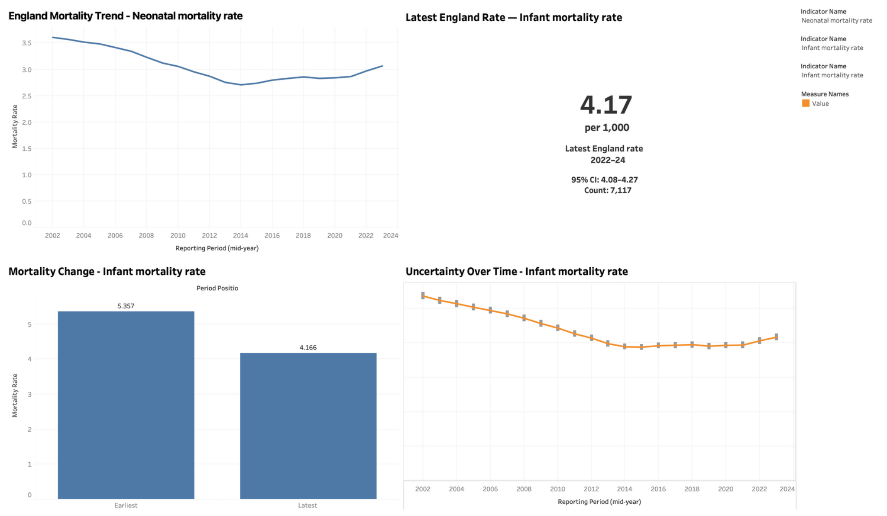

# Dashboard and worksheet guide

## Dashboard previews

### Data Quality Methodology

### Deprivation Mortality Inequality

### Local Authority Comparison

### National Mortality Trends

## Worksheet inventory

| Worksheet | Focus and interpretation |
|---|---|
| [S1: england mortality trend](../assets/worksheets/s1_england_mortality_trend.png) | Neonatal mortality across rolling periods; this differs from the infant indicator shown in S2–S4. |
| [S2: latest england kpi](../assets/worksheets/s2_latest_england_kpi.png) | Latest infant mortality KPI. The image interval differs from the CSV; see KNOWN_ISSUES.md. |
| [S3: mortality change](../assets/worksheets/s3_mortality_change.png) | Earliest/latest infant rate comparison. Percentage change uses unrounded CSV values. |
| [S4: mortality uncertainty](../assets/worksheets/s4_mortality_uncertainty.png) | Infant rates with reported confidence intervals. Adjacent rolling periods overlap. |
| [S5: local authority ranking](../assets/worksheets/s5_local_authority_ranking.png) | Full infant mortality ranking. Use reports/infant_top15.csv for a readable subset. |
| [S6: difference from england](../assets/worksheets/s6_difference_from_england.png) | Selected local rate differences from England, in rate units. |
| [S7: england comparison summary](../assets/worksheets/s7_england_comparison_summary.png) | Supplied England comparison categories. Five unavailable infant rates are not compared. |
| [S8: local authority confidence intervals](../assets/worksheets/s8_local_authority_confidence_intervals.png) | Confidence intervals for selected infant mortality authorities. Rankings have uncertainty. |
| [S9: mortality vs deprivation](../assets/worksheets/s9_mortality_vs_deprivation.png) | Infant mortality against child-weighted IMD score. Some points have unassigned quintiles. |
| [S10: mortality by deprivation quintile](../assets/worksheets/s10_mortality_by_deprivation_quintile.png) | Unweighted mean infant rate across supplied Q1–Q5 labels, covering 241 available rates. |
| [S11: child deprivation exposure](../assets/worksheets/s11_child_deprivation_exposure.png) | Selected high IDACI exposure authorities, coloured by infant rate. Historical child population weights apply. |
| [S12: priority matrix](../assets/worksheets/s12_priority_matrix.png) | Mortality/deprivation scatterplot with chart-average reference lines; not validated clinical thresholds. |
| [S13: data quality status](../assets/worksheets/s13_data_quality_status.png) | Source-reported quality results. Raw-source checks cannot all be rerun from the processed extracts. |
| [S14: indicator definitions](../assets/worksheets/s14_indicator_definitions.png) | Data-derived indicator summary. Formal definitions were not supplied. |

## Working with Tableau

The package includes image exports and supporting CSVs, but no `.twb` or `.twbx`. You can use the PNGs as visual references when building a new workbook. Exact original calculated fields, filters, actions and dashboard layout settings cannot be recovered from the images alone.

| Analytical area | Starting CSV |
|---|---|
| National trends and KPI | `mortality_trends.csv` |
| Local comparisons | `local_authority_comparison.csv` |
| Deprivation analysis | `deprivation_inequality.csv` |
| Quality dashboard | `data_quality_summary.csv` and `indicator_definitions.csv` |

Keep indicator and period filters explicit. Preserve missing values, rate units and source comparison categories. Do not join both local extracts in a way that duplicates the same mortality record. Treat missing quintiles as unassigned rather than deriving undocumented replacement groups.
